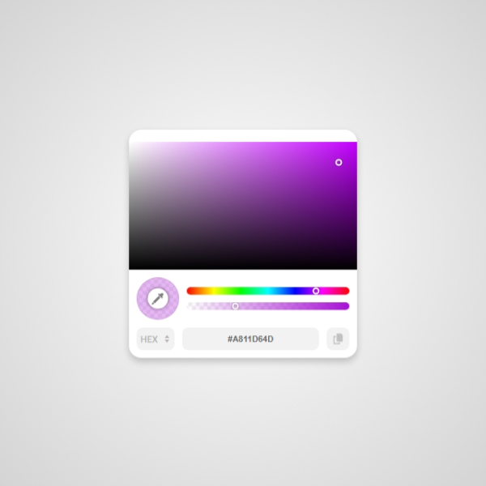
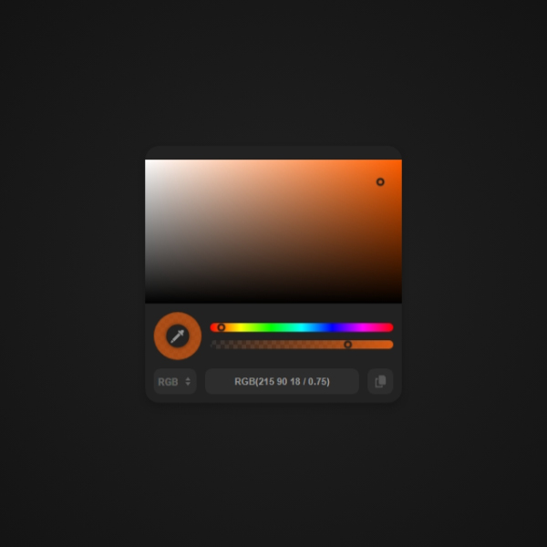

# Pyno Colorpicker

A lightweight, standalone, zero‑dependency color picker component for Angular.  
Supports **Hex**, **RGB** and **HSL** inputs in **any valid CSS format**, alpha channel, eyedropper, popup or inline mode, and full theming via CSS variables.

---

## 📸 Screenshots
 

---

## 📦 Installation

```bash
npm install pyno-colorpicker
```

---

## ✨ Features

- 🎨 Accepts any valid CSS color string — `#hex`, `rgb()`, `rgba()`, `hsl()`, `hsla()` — including **modern** space‑separated syntax, all hue units, percentages, and alpha.
- 🖱️ Popup (anchored to a trigger element) or **inline** mode.
- 📐 Horizontal alignment with `positionX` (`left` / `center` / `right`).
- 📏 Adjustable `width` (in pixels) directly from the template.
- 💧 Built‑in **EyeDropper** support (Chromium browsers, feature‑detected).
- 📋 One‑click copy of the current color value.
- 🌈 HSV board + hue bar + alpha bar.
- 🔁 Cycle between `hex` / `rgb` / `hsl` output modes.
- 🎛️ Fully themable with CSS custom properties.
- 🧩 Standalone Angular component (no NgModule required).
- 🪶 Zero runtime dependencies.

---

## 🚀 Quick Start

```ts
import { Component, signal } from '@angular/core';
import { PynoColorpicker } from 'pyno-colorpicker';

@Component({
  selector: 'app-root',
  imports: [PynoColorpicker],
  template: `
    <div
      #myElement
      class="myElement"
      [style.background-color]="value()">
    </div>

    <pyno-colorpicker
      [triggerFor]="myElement"
      [colorModes]="['hex', 'hsl', 'rgb']"
      [disableAlpha]="false"
      [value]="value()"
      [width]="300"
      [inline]="false"
      positionX="left"
      (onChange)="value.set($event.hex)"
      (onChangeEnd)="value.set($event.hex)">
    </pyno-colorpicker>
  `,
})
export class AppComponent {
  value = signal('#857fe6');
}
```

---

## 🧩 Usage

### 1. Popup mode (attached to a trigger)

```html
<button #trigger>Pick a color</button>

<pyno-colorpicker
  [triggerFor]="trigger"
  [value]="color()"
  (onChangeEnd)="color.set($event.hex)">
</pyno-colorpicker>
```

Clicking the trigger opens the picker below it. Clicking the overlay closes it.

### 2. Inline mode

```html
<div class="card">
  <pyno-colorpicker
    [inline]="true"
    [value]="color()"
    (onChange)="color.set($event.hex)">
  </pyno-colorpicker>
</div>
```

### 3. Custom modes and alpha

```html
<pyno-colorpicker
  [triggerFor]="trigger"
  [colorModes]="['rgb']"
  [disableAlpha]="true"
  [value]="'rgba(255, 0, 0, 0.5)'">
</pyno-colorpicker>
```

---

## 🎛️ Inputs

| Input          | Type                                | Default                     | Description                                                                      |
|----------------|-------------------------------------|-----------------------------|----------------------------------------------------------------------------------|
| `triggerFor`   | `HTMLElement`                       | `undefined`                 | The element the picker attaches to. Click opens the popup.                       |
| `inline`       | `boolean`                           | `false`                     | If `true`, renders the picker inline (no overlay, no positioning).               |
| `value`        | `string \| null \| undefined`       | `null`                      | Initial color. Accepts **any** valid CSS color string (see below).               |
| `colorModes`   | `('hex' \| 'rgb' \| 'hsl')[]`       | `['hex', 'hsl', 'rgb']`     | Modes the user can cycle through. If length is `1`, the mode button is disabled. |
| `disableAlpha` | `boolean`                           | `false`                     | If `true`, hides the alpha slider and the output alpha equals to `1`.              |
| `width`        | `number`                            | `300`                       | Picker width in pixels.                                                          |
| `positionX`    | `'left' \| 'center' \| 'right'`     | `'left'`                    | Horizontal alignment of the popup relative to the trigger.                       |

> The popup is always rendered **below** the trigger, with horizontal alignment controlled by `positionX`.

---

## 📤 Outputs

### `onChange`

Emits on every color change while dragging the board / sliders, and after a valid value is typed into the output input.

```ts
onChange = output<PynoColorpickerOutput>();
```

### `onChangeEnd`

Emits when a drag ends, or when a value is committed (e.g. eyedropper, `init()`).

```ts
onChangeEnd = output<PynoColorpickerOutput>();
```

### `PynoColorpickerOutput` shape

```ts
type PynoColorpickerOutput = {
  hex: string;          // '#ff0000' or '#ff000080' when alpha < 1
  rgb: string;          // 'rgb(255 0 0)' or 'rgb(255 0 0 / 0.5)'
  rgbObject: { r: number; g: number; b: number };
  hsl: string;          // 'hsl(0 100% 50%)' or 'hsl(0 100% 50% / 0.5)'
  hslObject: { h: number; s: number; l: number };
  alpha: number;        // 0 .. 1
};
```

Example handler:

```html
<pyno-colorpicker
  [value]="color()"
  (onChangeEnd)="onColor($event)">
</pyno-colorpicker>
```

```ts
onColor(out: PynoColorpickerOutput) {
  console.log(out.hex);              // '#857fe6'
  console.log(out.rgbObject);        // { r: 133, g: 127, b: 230 }
  console.log(out.hsl);              // 'hsl(245 68% 70%)'
  console.log(out.alpha);            // 1
}
```

---

## 🎨 Color Format Support

The `value` input accepts **any valid CSS color string**.  
The picker auto‑detects the format via `PynoColorpickerService.getMode()` and normalizes it.

### ✅ Hex

| Format            | Example           | Notes                                    |
|-------------------|-------------------|------------------------------------------|
| 3‑digit           | `#f00`            | Expanded to `#ff0000`.                   |
| 6‑digit           | `#ff0000`         |                                          |
| 8‑digit (alpha)   | `#ff000080`       | Alpha = `0x80 / 255 ≈ 0.5`.              |
| Mixed case        | `#Ff0000`         | Case‑insensitive.                        |

### ✅ RGB / RGBA

Accepts both **legacy** (comma) and **modern** (space + slash) syntax, mixed percentages and numbers, and optional alpha.

| Format                              | Example                          |
|-------------------------------------|----------------------------------|
| Legacy numbers                      | `rgb(255, 0, 0)`                 |
| Legacy numbers + alpha              | `rgba(255, 0, 0, 0.5)`           |
| Legacy percentages                  | `rgb(100%, 0%, 0%)`              |
| Legacy percentages + alpha          | `rgba(100%, 0%, 0%, 50%)`        |
| Modern space‑separated              | `rgb(255 0 0)`                   |
| Modern with slash alpha             | `rgb(255 0 0 / 0.5)`             |
| Modern with percentage alpha        | `rgb(255 0 0 / 50%)`             |
| Mixed number / percentage           | `rgb(255 0% 0)`                  |
| Uppercase                           | `RGB(255, 0, 0)`                 |

### ✅ HSL / HSLA

Supports all hue **units** (`deg`, `grad`, `rad`, `turn`), percentages for saturation and lightness, and optional alpha.

| Format                              | Example                             |
|-------------------------------------|-------------------------------------|
| Legacy degrees                      | `hsl(0, 100%, 50%)`                 |
| Legacy + alpha                      | `hsla(0, 100%, 50%, 0.5)`           |
| Modern space‑separated              | `hsl(0 100% 50%)`                   |
| Modern with slash alpha             | `hsl(0 100% 50% / 0.5)`             |
| Explicit degrees                    | `hsl(0deg 100% 50%)`                |
| Turns                               | `hsl(0.5turn 100% 50%)`             |
| Radians                             | `hsl(3.14159rad 100% 50%)`          |
| Gradians                            | `hsl(200grad 100% 50%)`             |
| Negative hue                        | `hsl(-120 100% 50%)`                |
| Out‑of‑range hue                    | `hsl(720 100% 50%)` → normalized    |
| Percentage alpha                    | `hsl(0 100% 50% / 50%)`             |

> Any invalid string is silently ignored (the picker keeps its previous value).

---

## 📐 Positioning (`positionX`)

The popup is always anchored **below** the trigger element. Horizontal alignment:

| Value     | Behaviour                                                         |
|-----------|-------------------------------------------------------------------|
| `left`    | Picker's left edge aligns with the trigger's left edge. (default) |
| `center`  | Picker is centered over the trigger.                              |
| `right`   | Picker's right edge aligns with the trigger's right edge.         |

The picker is automatically **clamped to the viewport** so it never overflows the left/right edges.  
On window **resize** and **scroll**, the position is recalculated automatically.

```html
<pyno-colorpicker
  [triggerFor]="box"
  positionX="center"
  [width]="320"
  [value]="color()">
</pyno-colorpicker>
```

---

## 🎨 Theming (CSS Variables)

Override any of these on `pyno-colorpicker` or a parent to fully restyle:

| Variable                         | Description                              |
|----------------------------------|------------------------------------------|
| `--pcp-bg-color`                 | Picker background.                       |
| `--pcp-border-radius`            | Corner radius.                           |
| `--pcp-shadow`                   | Box shadow.                              |
| `--pcp-trns-sqr-color`           | Transparency checkerboard color.         |
| `--pcp-trns-sqr-size`            | Checkerboard cell size.                  |
| `--pcp-transition`               | Transition used by hover effects.        |
| `--pcp-board-ratio`              | Aspect ratio of the HSV board.           |
| `--pcp-thumb-color`              | Thumb outline color.                     |
| `--pcp-eyedropper-size`          | Size of the eyedropper button (%).       |
| `--pcp-eyedropper-icon-color`    | Eyedropper icon color.                   |
| `--pcp-mode-bg-color`            | Background of mode / copy buttons.       |
| `--pcp-mode-bg-color-hover`      | Hover background of mode / copy buttons. |
| `--pcp-mode-text-color`          | Mode button text color.                  |
| `--pcp-mode-icon-color`          | Mode cycle arrows icon color.            |
| `--pcp-output-bg-color`          | Text input background.                   |
| `--pcp-output-bg-color-focus`    | Text input focus background.             |
| `--pcp-output-text-color`        | Text input color.                        |
| `--pcp-copy-icon-color`          | Copy icon color.                         |

> The picker width is **not** a CSS variable — use the `[width]` input instead so positioning can read it.

---

## 🖱️ Built‑in Interactions

- **HSV board** – drag to pick saturation / value.
- **Hue bar** – drag to pick hue.
- **Alpha bar** – drag to pick opacity (hidden if `disableAlpha` is `true`).
- **Mode button** – click to cycle through `colorModes` (disabled if only one mode).
- **Output input** – type any valid color string; it is parsed live.
- **Copy button** – copies the current `modeOutput()` to the clipboard and shows a checkmark for 3 s.
- **Eyedropper** – shown only when `window.EyeDropper` exists (Chromium browsers). Picks a color from anywhere on screen.
- **Overlay** – clicking outside the popup closes it (popup mode only).

---

## 🌐 Browser Support

| Feature       | Support                                                  |
|---------------|----------------------------------------------------------|
| Core picker   | All modern browsers (Chrome, Edge, Firefox, Safari).     |
| EyeDropper    | Chromium‑based only (feature‑detected at runtime).       |
| Clipboard API | Requires HTTPS or `localhost`.                           |

---

## 📚 API Reference

### `PynoColorpicker` component

```ts
class PynoColorpicker {
  // Inputs
  triggerFor: InputSignal<HTMLElement | undefined>;
  inline: InputSignal<boolean>;
  colorModes: InputSignal<PynoColorMode[]>;
  disableAlpha: InputSignal<boolean>;
  value: InputSignal<string | null | undefined>;   // alias for initValue
  width: InputSignal<number>;
  positionX: InputSignal<'left' | 'center' | 'right'>;

  // Outputs
  onChange: OutputEmitterRef<PynoColorpickerOutput>;
  onChangeEnd: OutputEmitterRef<PynoColorpickerOutput>;

  // Public methods
  open(): void;
  close(): void;
  output(): PynoColorpickerOutput;
}
```

### `PynoColorpickerService`

Injected via `providedIn: 'root'`. Useful if you want to reuse the parsing/conversion logic:

```ts
class PynoColorpickerService {
  getMode(val: string): 'hex' | 'rgb' | 'hsl' | null;
  isRgb(val: string): boolean;

  parseHex(val: string): PynoColorHexObject | null;
  parseRgb(val: string): PynoColorRgbObject | null;
  parseHsl(val: string): PynoColorHslObject | null;

  hexToRgb(hex: string): PynoColorRgbObject;
  rgbToHex(rgb: PynoColorRgbObject): string;
  rgbToHsl(rgb: PynoColorRgbObject): PynoColorHslObject;
  hslToRgb(hsl: PynoColorHslObject): PynoColorRgbObject;
  rgbToHsv(rgb: PynoColorRgbObject): PynoColorHsvObject;
  hsvToRgb(hsv: PynoColorHsvObject): PynoColorRgbObject;

  alphaToHex(alpha: number): string;
}
```


---

## 📄 License

MIT © Pyno

Designed & developed by [Amir Navidfar](https://github.com/amirhsnf)

---

## 🤝 Contributing

Issues and PRs are welcome. Please open an issue first to discuss what you'd like to change.
